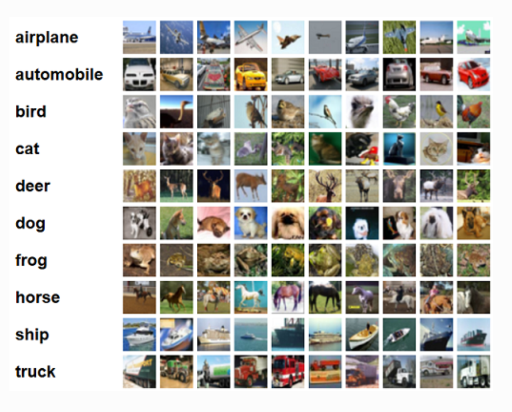
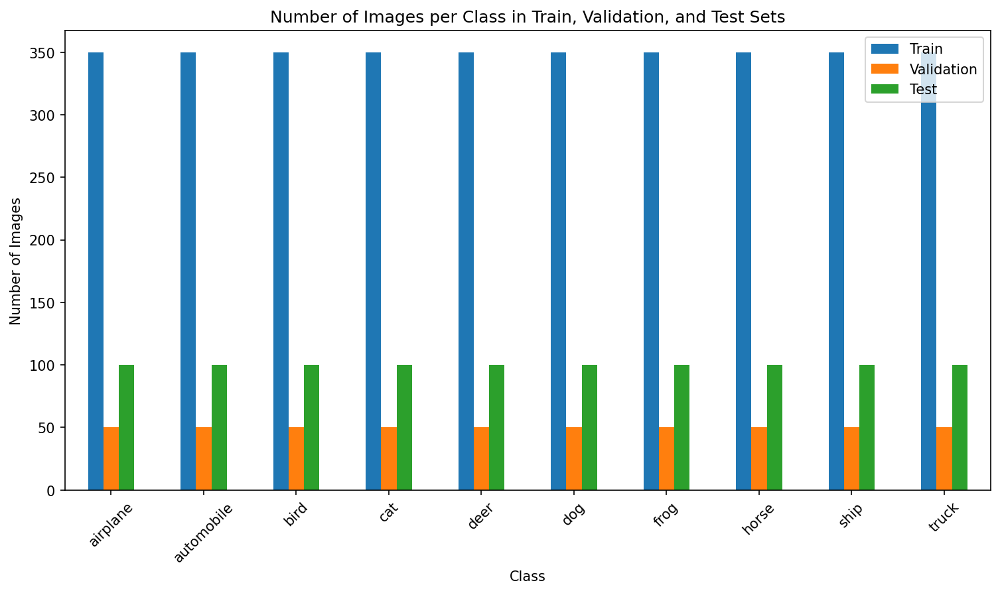
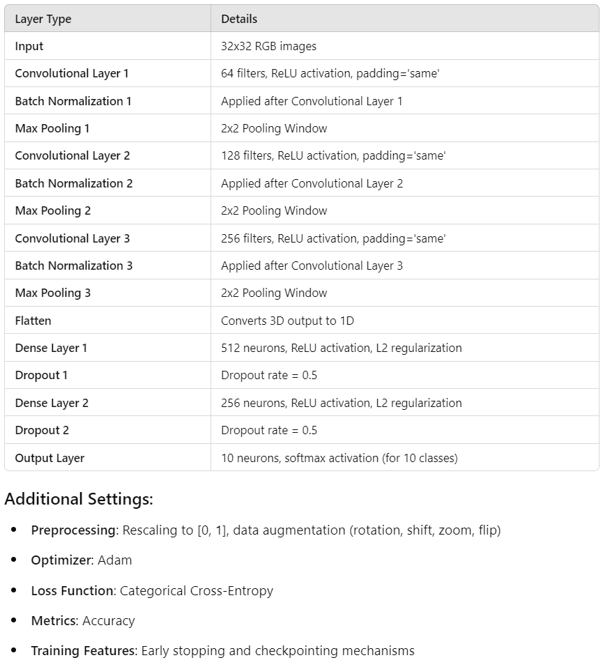
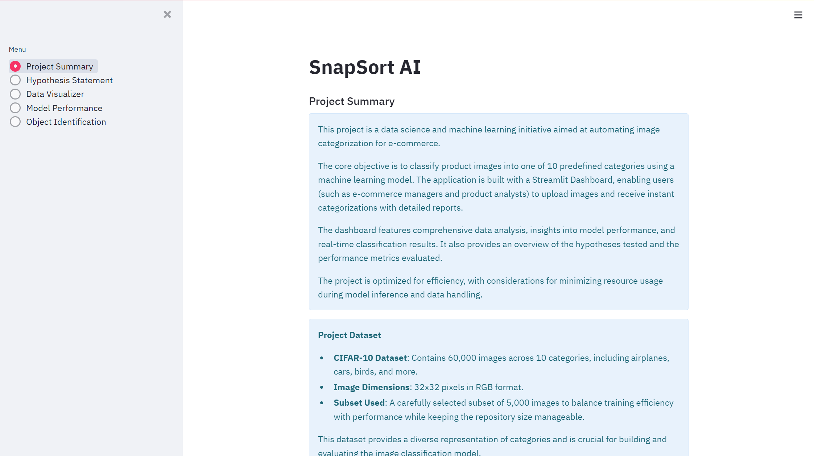
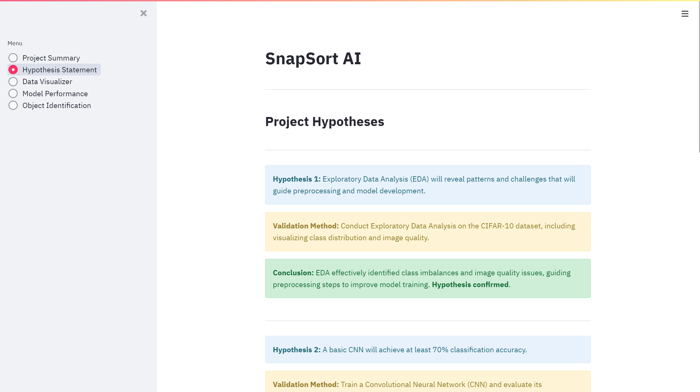
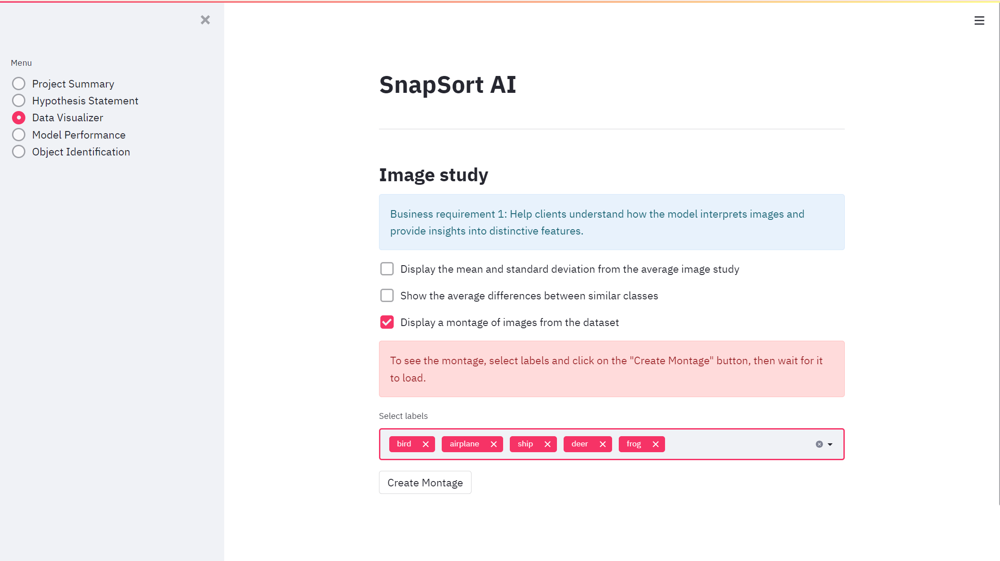
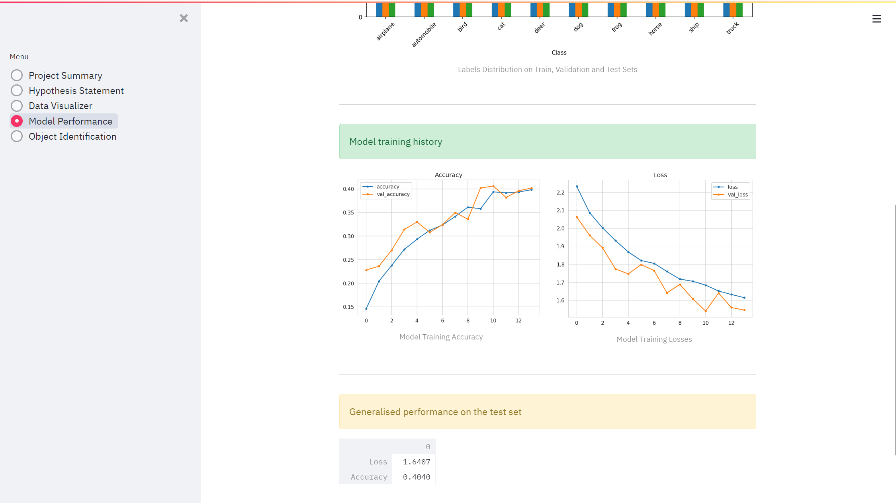
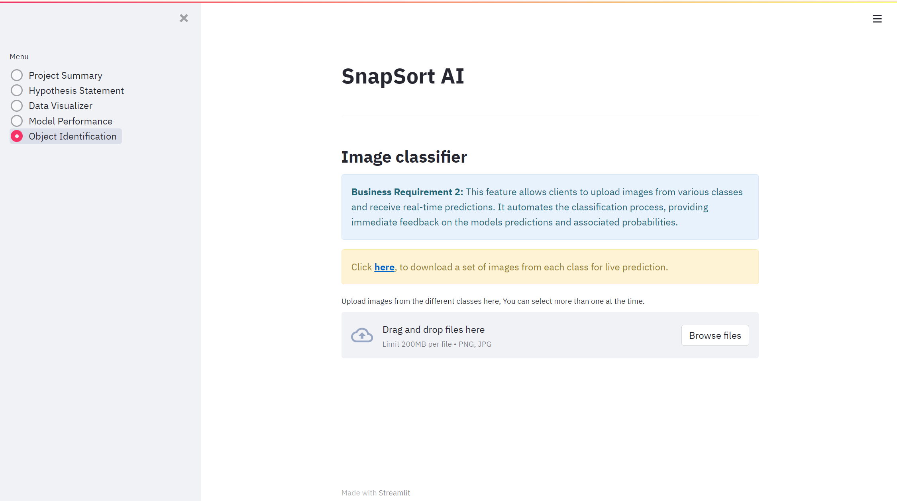
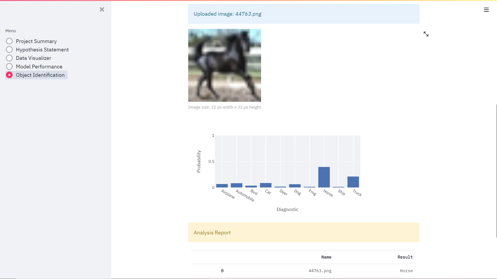
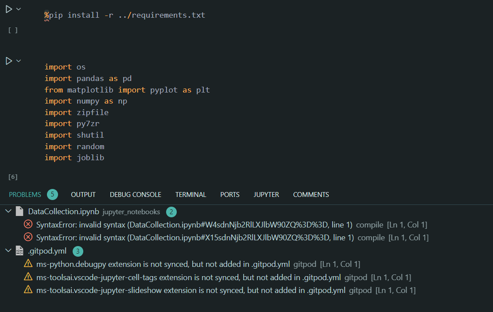

# SNAPSORT AI

**A Data Science and Machine Learning project developed as part of a course in Predictive Analytics, my final project at Code Institute.**

---

Live link to: [SnapSort AI](https://snapsortai-6a51de21efef.herokuapp.com/)
## Project Overview

A client in e-commerce seeks a machine learning solution to automate product image categorization, currently performed manually. The project follows two phases:

1. **Dataset Analysis**: Understanding the CIFAR-10 dataset.
2. **Model Development**: Creating an image classification model to automate the process.

The CIFAR-10 dataset consists of 60,000 images across 10 categories, and the goal is to automate categorization with a scalable model for future use.

---

## Dataset Content

- **Source**: [CIFAR-10 dataset from Kaggle](https://www.kaggle.com/competitions/cifar-10).
- **Image Size**: 32x32 pixels in RGB format.
- **Subset**: 5,000 images for training.
- **Categories**: 10 classes (e.g., airplanes, cars, birds, frogs).

This subset balances training efficiency and performance while adhering to GitHub's file size limits.

---

## Business Requirements

1. **Dataset Analysis**:
   - Analyze the CIFAR-10 dataset to understand image distribution, patterns, and potential challenges.

2. **Model Development**:
   - Develop an image classification model to automate categorization.

3. **Performance Evaluation**:
   - Assess model performance in terms of accuracy and efficiency.

[Back to top](#SNAPSORT-AI)

---

## Hypothesis and Validation Process

- **Hypothesis 1**: 
  - Exploratory Data Analysis (EDA) will reveal patterns and challenges that will guide preprocessing and model development.

- **Hypothesis 2**: 
  - A basic CNN will achieve at least 70% classification accuracy.

- **Hypothesis 3**: 
  - Data augmentation (e.g., rotating, flipping, zooming) will enhance model accuracy by at least 5%.

## Validation Process

### Accuracy

- **Overall Model Correctness**: The primary validation metric used for this model is accuracy, which measures the ratio of correctly predicted instances to the total instances.

### Future Considerations

While the current validation focuses on accuracy, incorporating additional metrics such as precision, recall, and F1 score could provide deeper insights into model performance:

- **Precision**: Indicates the correctness of positive predictions.
- **Recall**: Measures how well the model identifies true positive instances.
- **F1 Score**: Balances precision and recall into a single metric, especially useful for imbalanced datasets.

Implementing these metrics in future iterations will enhance the model evaluation and help guide improvements.

### Success Metrics

- **Target Accuracy**: At least 70% accuracy on the test set.
- **Data Augmentation Impact**: Expect at least a 5% improvement in accuracy.

### Implications

Validating these hypotheses will confirm the efficacy of combining CNNs with advanced techniques and guide future model improvements.

[Back to top](#snapsort-ai)

---

## Rationale for Mapping Business Requirements to Data Visualizations and ML Tasks

### 1. Dataset Exploration
- **Business Requirement:** Analyze the CIFAR-10 dataset.
- **ML Task:** Perform Exploratory Data Analysis (EDA) to uncover data patterns, including class distribution and image quality.
- **Rationale**: Understanding the dataset's structure, class balance, and potential challenges is crucial for model training and performance. Data visualizations like class distribution plots, and sample image grids help identify any biases or inconsistencies early in the process.

### 2. Model Development
- **Business Requirement:** Build and optimize a Convolutional Neural Network (CNN) for image classification.
- **ML Task:** Develop, train, and fine-tune the CNN architecture using TensorFlow and Keras.
- **Rationale:** A well-optimized CNN model is central to automating the image classification process. The choice of layers, activation functions, and regularization techniques, as well as the inclusion of data augmentation, improves the model’s accuracy and robustness.

### 3. Performance Metrics
- **Business Requirement:** Achieve high model accuracy.
- **ML Task:** Evaluate the model using accuracy, precision, recall, F1 score, and a confusion matrix.
- **Rationale:** These metrics provide a comprehensive understanding of the model’s performance. Visualizations like accuracy/loss graphs and confusion matrices make it easier to track progress and identify areas for improvement.

### 4. Interpretability
- **Business Requirement:** Offer insights into the model’s predictions.
- **ML Task:** Generate interpretable visualizations like confusion matrices, class activation maps (CAM), and predicted vs. actual results.
- **Rationale:** Visualization tools increase transparency, allowing clients to understand how the model makes decisions. This builds trust in the AI system, ensuring that predictions are not just accurate but also explainable.

### 5. Efficiency
- **Business Requirement:** Ensure the model is efficient in training and inference.
- **ML Task:** Implement early stopping, checkpointing, and model optimizations to reduce training time while maintaining accuracy.
- **Rationale:** Efficient models ensure scalability and practical use in real-time applications. Time series plots of training and validation loss/accuracy help stakeholders monitor the model’s learning efficiency over time.

---

## Model Development

### CNN Architecture

- **Input**: 32x32 RGB images.
- **Layers**:
  - **Convolutional Layers**: 
    - 3 layers with 64, 128, and 256 filters, respectively, each using ReLU activation and padding set to 'same'.
    - Each convolutional layer is followed by Batch Normalization to stabilize learning and Max Pooling for downsampling.
  - **Flattening**: Flattens the 3D output to 1D.
  - **Dense Layers**: 
    - Two fully connected layers with 512 and 256 neurons, respectively, both using ReLU activation and L2 regularization to mitigate overfitting.
    - Includes Dropout layers (0.5) for further regularization.
  - **Output Layer**: A final Dense layer with 10 neurons (softmax activation) to classify the 10 categories.

### Preprocessing

- **Rescaling**: Images are normalized to the range [0, 1].
- **Data Augmentation**: 
  - When enabled, applies rotation, width/height shifts, zooms, and horizontal flips to enhance training robustness.

### Compilation & Training

- **Optimizer**: Adam optimizer is used for efficient training.
- **Loss Function**: Categorical cross-entropy is employed to handle multi-class classification.
- **Metrics**: Accuracy is tracked during training.
- **Training**: Implemented early stopping and checkpointing mechanisms to optimize the training process and prevent overfitting.

> **Model Diagram**: 

[Back to top](#snapsort-ai)

---

## Dashboard Design

### Dashboard Pages:

1. **Project Summary**: Overview of the project and objectives.
2. **Data Visualizer**: Visual representation of the dataset and preprocessing steps.
3. **Model Performance**: Detailed metrics, including accuracy and confusion matrix.
4. **Image Classifier**: Upload images and receive real-time predictions.
5. **Hypothesis and Results**: Discussion of hypothesis, results, and future work.

# The Streamlit Dashboard includes:

  
1st Page - Project Summary

   
  This page provides a summary of the project, objectives, and business requirements:
  
   
  
  

 

  
2nd Page - Hypothesis and Results

   
  Discusses the hypothesis and points out considerations for using the model:

 

  

 

  
3rd Page - Data Visualizer

   
  Shows the type of data and preprocessing steps:

   
  
  

 

  
4th Page - Model Performance

   
  Details the model's performance metrics:

    This image doesn't reflect the actual model performance

   
  
  

 

  
5th Page - Image Classifier

   
  Allows users to upload images and make live predictions:

   
  
  

   
  Example of an analysis report:

   

  

 

[Back to top](#SNAPSORT-AI)

---

## Kanban Board

### User Stories

The Kanban board outlines key user stories and deadlines to ensure the project meets client objectives.

#### 1. Interactive Dashboard Navigation
- **Story**: As a client, I want an interactive dashboard for easy data visualization.
- **Goal**: Ensure intuitive navigation and effective data analysis.

#### 2. Data Verification
- **Story**: As a client, I want to verify the accuracy of the data.
- **Goal**: Provide transparency and data integrity.

#### 3. Model Accuracy Demonstration
- **Story**: As a client, I want a clear demonstration of the model's accuracy.
- **Goal**: Showcase model effectiveness with technical details.

#### 4. Model Testing by Uploading Pictures
- **Story**: As a client, I want to upload pictures to test the model’s capabilities.
- **Goal**: Enable interaction with the model using client data.

#### 5. Understanding Technical Processes
- **Story**: As a client, I want to understand the technical processes involved in building the model.
- **Goal**: Provide insights into model development.

### Project Status

All user stories have been successfully implemented, and the project is complete.

[Back to top](#SNAPSORT-AI)

---

## Unfixed Bugs

### Bug Report: `StreamlitAPIException` - `set_page_config()` Issue

**Description:**
The following error occurs intermittently when launching the app:
- StreamlitAPIException: set_page_config() can only be called once per app, and must be called as the first Streamlit command in your script
  - This exception appears even though the script is configured according to the documentation. The issue seems to arise occasionally upon entering the app, and clearing the cache and rerunning it resolves the problem temporarily.

- File "/app/app.py", line 11, in <module> app = MultiPage(app_name="SnapSort AI") # Create an instance of the app File "/app/app_pages/multipage.py", line 24, in init st.set_page_config(

**Steps to Reproduce:**
1. Run the app from the main entry point.
2. Occasionally, the `StreamlitAPIException` is raised.
3. Clear the cache and rerun the app navigate to summary page; the error disappears temporarily.

**Expected Behavior:**
The app should run without errors, with `st.set_page_config()` being executed correctly as the first Streamlit command.

**Investigation:**
- The `set_page_config()` function is confirmed to be called as the first command in the script, as per the Streamlit documentation.
- The error seems to occur sporadically, possibly due to caching issues or how the script is being loaded.

**Temporary Workaround:**
- Clearing the cache and rerunning the app temporarily resolves the issue, but this is not an ideal long-term solution.

**Suggested Fix:**
- Double-check that no other `set_page_config()` calls are being made elsewhere in the script or other modules.
- Ensure that no dependencies or async operations are delaying the execution of `set_page_config()` as the first command.
- Review the settings and Streamlit documentation for any caching-related configurations that might affect script execution order.

For more detailed information, refer to the [Streamlit docs](https://docs.streamlit.io/).

### Issues

- During development, several compatibility challenges were encountered due to changes in library versions and syntax updates.
- These issues included dependency conflicts between different libraries, which often led to errors.
- To resolve this, I opted to use the requirements document from the CI Malaria Detector walkthrough project.
- This ensured the correct versions of libraries and dependencies were installed, providing a stable and compatible environment for the project.
- Heroku Issues - When I tried to deploy the working version of the Streamlit app on Heroku, there were issues with the size of the repo. I added to .slugignore the list of directories that weren't necessary for the execution of the app, but the slug file is still over the limit size and can slow down the deployment or lead to a failure due to Heroku's slug size limit."

[Back to top](#SNAPSORT-AI)

---

## Deployment

### Heroku

* The App live link is: https://snapsortai-6a51de21efef.herokuapp.com/
* Set the runtime.txt Python version to a [Heroku-20](https://devcenter.heroku.com/articles/python-support#supported-runtimes) stack currently supported version.
* The project was deployed to Heroku using the following steps.

1. Log in to Heroku and create an App
2. Log into Heroku CLI in IDE workspace terminal using the bash command: *heroku login -i* and enter user credentials (You'll need your Heroku API key)
3. Set the app's stack to heroku-20 using the bash command: *heroku stack:set heroku-20* for compatibility with the Python 3.8.14 version used for this project
4. At the Deploy tab in Heroku, select GitHub as the deployment method.
5. Select your repository name and click Search. Once it is found, click Connect.
6. Select the branch you want to deploy, then click Deploy Branch.
7. The deployment process should happen smoothly if all deployment files are fully functional.
8. Click the button "Open App" on the top of the page to access your App.
9. If the slug size is too large then add large files not required for the app to the .slugignore file.

### Forking the GitHub Project
To make a copy of the GitHub [repository](https://github.com/EVondrus/SnapSortAI) to use on your own account, one can fork the repository by doing as follows:

On the page for the repository, go to the 'Fork' button on the top right of the page, and click it to create a copy of the repository which should then be on your own GitHub account.

### Making a Local Clone
On the page for the repository, click the 'Code' button
To clone the repository using HTTPS, copy the HTTPS URL provided there
Open your CLI application of choice and change the current working directory to the location where you want the cloned directory to be made.
Type git clone, and then paste the previously copied URL to create the clone

---

## Main Data Analysis and Machine Learning Libraries

- **NumPy**: Essential for performing numerical operations on image data, including preprocessing and preparing data for model input.
- **Pandas**: Used to manage and analyze structured data related to images, such as filenames, labels, and image dimensions.
- **Matplotlib**: Utilized to create static visualizations, including plots of model accuracy and loss over epochs.
- **Seaborn**: Enhances Matplotlib with additional statistical plotting capabilities, helping to visualize data distributions and model performance.
- **Plotly**: Provides interactive visualizations within the Streamlit app, allowing users to explore predictions and data in more detail.
- **TensorFlow**: Core library for defining and training the convolutional neural network (CNN) model, including building and optimizing the architecture.
- **Keras**: A high-level API used alongside TensorFlow for constructing and evaluating the CNN model, simplifying the process of model development.
- **Joblib**: Facilitates saving and loading the trained machine learning model, enabling quick deployment without the need for retraining.
- **Streamlit**: Used to create an interactive dashboard for the client, providing a user-friendly interface for visualizing model performance and making predictions.
- **Kaggle**: The source of the CIFAR-10 dataset, which serves as the basis for training and evaluating the image classification model.
- **PIL Image**: Used for image manipulation

[Back to top](#SNAPSORT-AI)

---

## TESTING

### Manual Testing

#### User Story Testing

**Business Requirement 1: Data Visualization**  
1. As a client, I want an interactive dashboard for easy data visualization.

| Feature                 | Action                            | Expected Result                                      | Actual Result              |
|-------------------------|-----------------------------------|-----------------------------------------------------|----------------------------|
| Navigation bar          | Selecting buttons in the side Menu| Selected page displayed with correct information     | Functions as expected       |

**Data Visualizer Page**  
- As a client, I can view visual representations of the dataset and preprocessing steps.

| Feature                    | Action                              | Expected Result                                   | Actual Result               |
|----------------------------|-------------------------------------|-------------------------------------------------- |-----------------------------|
| Dataset summary            | Viewing the dataset summary         | Summary of dataset displayed correctly            | Functions as expected       |
| Class distribution graph   | Clicking on the graph option        | Class distribution graph is rendered              | Functions as expected       |

**Model Performance Page**  
- As a client, I want to see the model’s performance metrics.

| Feature                    | Action                              | Expected Result                                   | Actual Result               |
|----------------------------|-------------------------------------|-------------------------------------------------- |-----------------------------|
| Accuracy graph             | Clicking on the accuracy graph      | Accuracy over epochs graph is displayed           | Functions as expected       |
| Confusion matrix           | Clicking on the confusion matrix    | Confusion matrix visualized correctly             | Functions as expected       |

---

**Business Requirement 2: Classification**  

**Image Classifier Page**  
- As a client, I can upload images to the dashboard so that I can get predictions.

| Feature                    | Action                              | Expected Result                                   | Actual Result               |
|----------------------------|-------------------------------------|-------------------------------------------------- |-----------------------------|
| File uploader              | Uploading image files via Browse    | Prediction of the category displayed              | Functions as expected       |

- As a client, I want to save model predictions in a timestamped CSV file.

| Feature                    | Action                              | Expected Result                                  | Actual Result               |
|----------------------------|-------------------------------------|--------------------------------------------------|-----------------------------|
| Download Report link       | Clicking on the download link       | A CSV file with timestamps and prediction details is saved on the client's machine | Functions as expected        |

---

**Business Requirement 3: Performance Evaluation**  

**Model Evaluation Page**  
- As a client, I want to assess the model's performance metrics to ensure it meets accuracy standards.

| Feature                    | Action                              | Expected Result                                   | Actual Result               |
|----------------------------|-------------------------------------|-------------------------------------------------- |-----------------------------|
| Performance metrics display | Navigating to the performance page | Display of accuracy, precision, recall, and F1-score | Functions as expected    |
| Visualizations             | Clicking on metric visualizations   | Graphs showing model performance over epochs     | Functions as expected        |
| Confusion matrix           | Viewing the confusion matrix        | Correct visual representation of model misclassifications | Functions as expected |

### Validation

- For the Streamlit app pages and source code files, I used the [CI Python Linter](https://pep8ci.herokuapp.com/).

## Credits 

Special thanks to Code Institute for the deployment template and Kaggle for the dataset.

### Content 

- The dataset is sourced from [Kaggle](https://www.kaggle.com/competitions/cifar-10).

### Code

- Part of the code is adapted from Code Institute’s walkthrough project - Malaria Detection.

---

## Acknowledgements

- Special thanks to those who provided support throughout this project.
  - Community Sweden -Slack Channel for endless support
  - Niclas Hughdahl - Troubleshooting buddy
  - Mladen Djurdjevic - For keeping me alive during the development of this project

